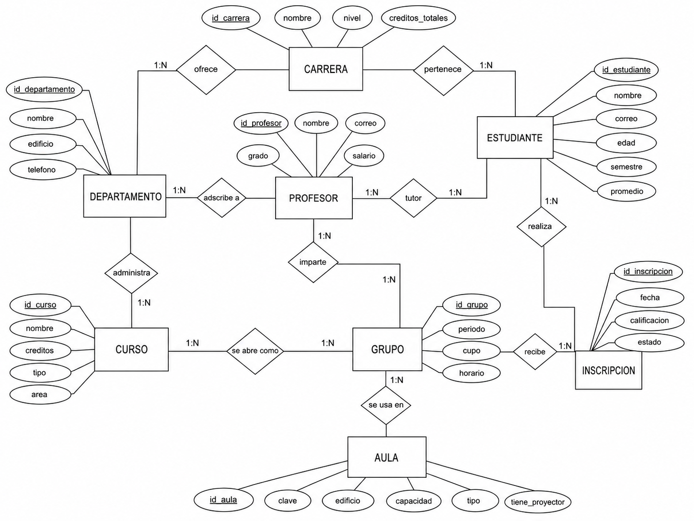

# Prácticas 7, 8 y 9 - Operaciones del Álgebra Relacional

## Datos generales

**Dominio:** Sistema universitario
**Integrante:** Julio Adrian Milan Huidobro
**Unidad de aprendizaje:** Bases de Datos
**Programa académico:** Ingeniería en Sistemas Computacionales
**Institución:** Instituto Politécnico Nacional - Escuela Superior de Cómputo

---

## Descripción del proyecto

Este repositorio contiene el desarrollo de las prácticas 7, 8 y 9 de la unidad de aprendizaje de Bases de Datos.
El proyecto se basa en un **sistema universitario**, el cual permite representar la información relacionada con departamentos, carreras, profesores, estudiantes, cursos, grupos, aulas e inscripciones.

El objetivo principal es aplicar las operaciones del **álgebra relacional**, el **cálculo relacional de tuplas**, el **cálculo relacional de dominios** y su equivalencia con **SQL**.

El sistema fue diseñado para practicar consultas básicas y avanzadas sobre una base de datos relacional, utilizando PostgreSQL como sistema gestor de base de datos.

---

## Objetivo

Aplicar y comprender las operaciones del álgebra relacional y del cálculo relacional como base teórica para la manipulación de datos en bases de datos relacionales.

También se busca demostrar la equivalencia entre:

* Álgebra Relacional.
* Cálculo Relacional de Tuplas.
* Cálculo Relacional de Dominios.
* SQL.

---

## Contenido del repositorio

```text
├── README.md
├── docker-compose.yml
├── diagramas/
│   ├── modelo_relacional.png
│   └── modelo_eer.dot
├── sql/
│   ├── 01_schema.sql
│   ├── 02_data.sql
│   ├── 03_consultas_basicas.sql
│   ├── 04_consultas_avanzadas.sql
│   └── 05_consultas_finales_20.sql
└── resultados/
    └── resultados_consultas.md
```

---

## Modelo del sistema

El sistema universitario está formado por 8 relaciones principales:

1. **Departamento**
2. **Carrera**
3. **Profesor**
4. **Estudiante**
5. **Curso**
6. **Grupo**
7. **Aula**
8. **Inscripción**

Estas tablas se encuentran relacionadas mediante claves primarias y claves foráneas, permitiendo representar correctamente la estructura de una institución académica.

---

## Diagrama Entidad-Relación Extendido

El diagrama Entidad-Relación Extendido muestra las entidades, atributos, relaciones y cardinalidades del sistema universitario.



---

## Modelo relacional

El modelo relacional representa la estructura final de la base de datos, incluyendo tablas, claves primarias y claves foráneas.


---

## Tecnologías utilizadas

* PostgreSQL
* pgAdmin
* SQL
* Docker
* GitHub
* Álgebra Relacional
* Cálculo Relacional de Tuplas
* Cálculo Relacional de Dominios

---

## Instalación y ejecución en pgAdmin

### 1. Crear la base de datos

Dentro de pgAdmin, crear una nueva base de datos con el siguiente nombre:

```sql
CREATE DATABASE practica789;
```

Después de crearla, conectarse a la base de datos `practica789`.

---

### 2. Ejecutar el script de creación de tablas

Abrir la herramienta **Query Tool** y ejecutar el archivo:

```text
sql/01_schema.sql
```

Este archivo crea todas las tablas, claves primarias y claves foráneas del sistema.

---

### 3. Insertar los datos de prueba

Después de crear las tablas, ejecutar:

```text
sql/02_data.sql
```

Este archivo inserta los datos necesarios para realizar las consultas de la práctica.

---

### 4. Ejecutar las consultas básicas

Para revisar las consultas de selección, proyección, conjuntos y producto cartesiano, ejecutar:

```text
sql/03_consultas_basicas.sql
```

---

### 5. Ejecutar las consultas avanzadas

Para revisar consultas con reuniones, agrupaciones, funciones agregadas y división, ejecutar:

```text
sql/04_consultas_avanzadas.sql
```

---

### 6. Ejecutar las 20 consultas finales

Para revisar el caso integrador con las 20 consultas principales, ejecutar:

```text
sql/05_consultas_finales_20.sql
```

---

## Ejecución con consola PostgreSQL

También se pueden ejecutar los archivos desde consola con los siguientes comandos:

```bash
psql -d practica789 -f sql/01_schema.sql
psql -d practica789 -f sql/02_data.sql
psql -d practica789 -f sql/03_consultas_basicas.sql
psql -d practica789 -f sql/04_consultas_avanzadas.sql
psql -d practica789 -f sql/05_consultas_finales_20.sql
```

---

## Ejecución con Docker

El repositorio incluye un archivo `docker-compose.yml` para levantar PostgreSQL de forma rápida.

Para iniciar el contenedor:

```bash
docker compose up -d
```

Después se puede conectar a la base de datos desde pgAdmin o desde consola usando los datos definidos en el archivo `docker-compose.yml`.

Para detener el contenedor:

```bash
docker compose down
```

---

## Consultas incluidas

El proyecto incluye consultas sobre los siguientes temas:

### Operadores básicos

* Selección.
* Proyección.
* Unión.
* Intersección.
* Diferencia.
* Producto cartesiano.

### Operadores avanzados

* Reunión natural.
* Theta Join.
* Left Join.
* Right Join.
* Full Join.
* Semi Join.
* Anti Join.
* Self Join.

### Agregación y agrupación

* COUNT.
* SUM.
* AVG.
* MAX.
* MIN.
* GROUP BY.
* HAVING.

### División

Se incluyen consultas que permiten resolver casos donde se necesita encontrar elementos relacionados con todos los elementos de otro conjunto.

### Cálculo relacional

También se incluyen consultas equivalentes en:

* Cálculo Relacional de Tuplas.
* Cálculo Relacional de Dominios.
* SQL.

---

## Resultados

Los resultados de ejemplo de las consultas se encuentran en:

```text
resultados/resultados_consultas.md
```

Este archivo permite revisar la salida esperada de diferentes consultas ejecutadas sobre la base de datos.

---

## Archivos SQL

### `01_schema.sql`

Contiene la creación de todas las tablas del sistema universitario, junto con sus claves primarias, claves foráneas y restricciones.

### `02_data.sql`

Contiene los datos de prueba del sistema. Estos datos permiten realizar consultas realistas sobre estudiantes, profesores, carreras, cursos, grupos, aulas e inscripciones.

### `03_consultas_basicas.sql`

Contiene consultas relacionadas con los operadores básicos del álgebra relacional.

### `04_consultas_avanzadas.sql`

Contiene consultas con reuniones, funciones agregadas, agrupaciones y división.

### `05_consultas_finales_20.sql`

Contiene las 20 consultas principales del caso integrador, expresadas en SQL y relacionadas con su equivalente en álgebra y cálculo relacional.

---

## Generación del diagrama relacional en pgAdmin

Para generar el diagrama relacional:

1. Abrir pgAdmin.
2. Crear o seleccionar la base de datos `practica789`.
3. Ejecutar `sql/01_schema.sql`.
4. Verificar que las tablas aparezcan en el esquema `public`.
5. Abrir la herramienta de diagrama ERD de pgAdmin.
6. Agregar las tablas del sistema.
7. Exportar la imagen del modelo relacional.
8. Guardar la imagen en la carpeta `diagramas/` con el nombre:

```text
modelo_relacional.png
```

---

## Conclusión

Este proyecto permitió aplicar de forma práctica los conceptos de álgebra relacional, cálculo relacional y SQL dentro de un sistema universitario.
A través del diseño de tablas, relaciones, diagramas y consultas, se reforzó la importancia de estructurar correctamente una base de datos antes de utilizarla.

Además, se demostró que una misma consulta puede representarse de distintas formas, ya sea mediante álgebra relacional, cálculo relacional de tuplas, cálculo relacional de dominios o SQL, obteniendo el mismo resultado.

---

## Entregable

El repositorio contiene todos los elementos necesarios para la entrega de las prácticas 7, 8 y 9:

* Base de datos.
* Datos de ejemplo.
* Consultas SQL.
* Diagramas.
* Resultados.
* Documentación.
* Archivo README.
* Configuración con Docker.


Tambien se incluyen los resultados de consulta en:

```text
resultados/resultados_consultas.md
```
